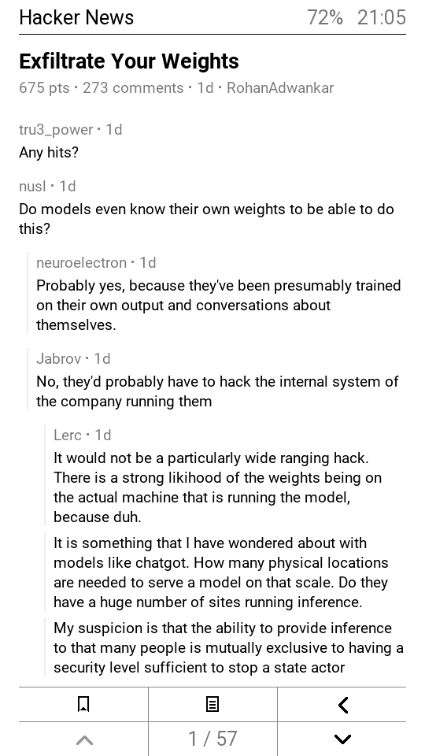
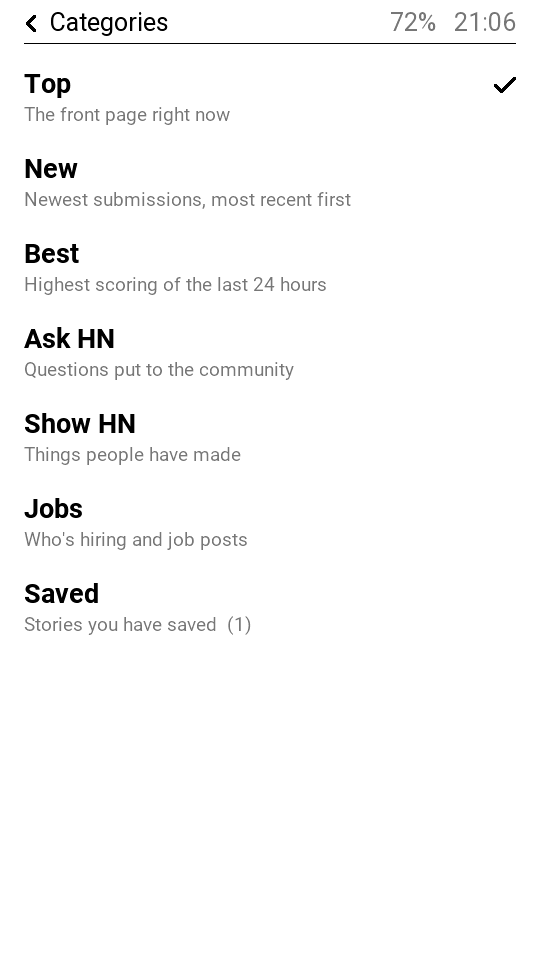
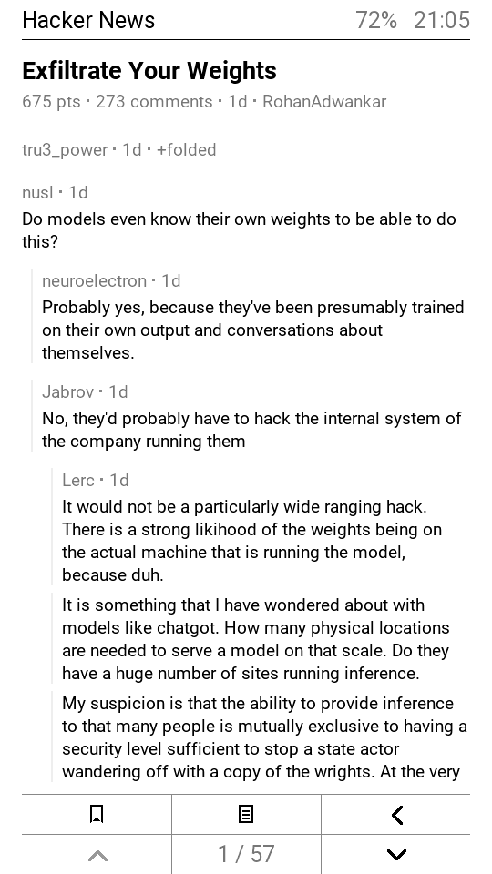
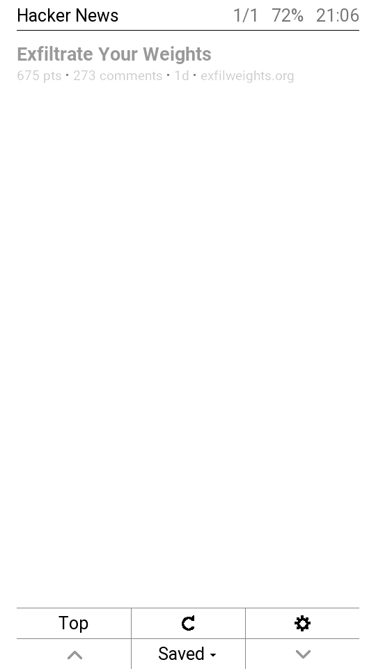
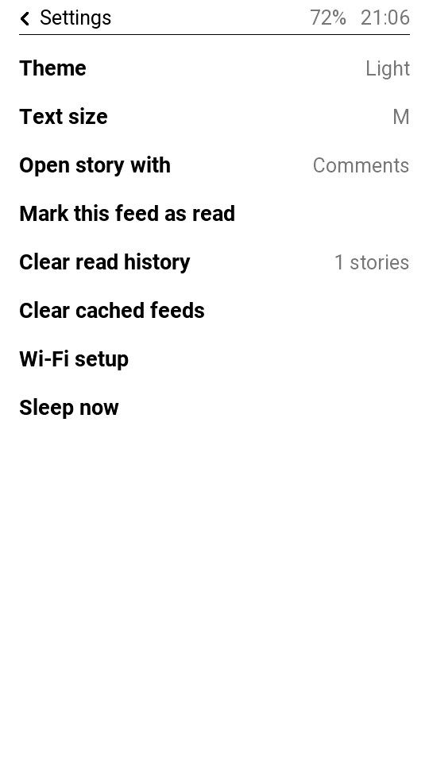
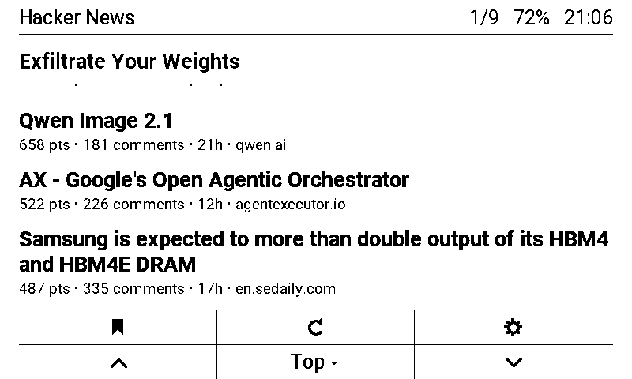

# Hacker News for the LilyGo T5 E-Paper S3 Pro

A Hacker News reader for the phone-shaped 4.7" e-paper handheld. Read-only by
design — no commenting, voting or login — with everything a reader wants: all
categories, full comment threads you can fold, bookmarks, read/unread
tracking, light and dark themes, and a reader-mode browser for the linked
articles.

It also comes with a **desktop emulator**: the same firmware UI compiled for
macOS, drawn by the device's own glyph renderer, against live Hacker News.
Every screen below was captured from it, and it renders pixel-for-pixel what
the panel does.

<p align="center">
  
  
  
</p>

## Screenshots

<table>
<tr>
<td align="center"><br><sub>Story list — a read story at 40 % ink</sub></td>
<td align="center"><br><sub>Comments</sub></td>
<td align="center"><br><sub>Tap a byline to fold its replies</sub></td>
<td align="center"><br><sub>Saved stories</sub></td>
</tr>
<tr>
<td align="center"><br><sub>Categories</sub></td>
<td align="center"><br><sub>Settings</sub></td>
<td align="center"><br><sub>Dark theme</sub></td>
<td align="center"><br><sub>Same code on a TRMNL (800×480, 1-bit)</sub></td>
</tr>
</table>

## Install it on the device

The board has no launcher and no home screen: whatever you flash *is* what the
device runs at power-on. This app replaces LilyGo's factory firmware, and
[restoring that firmware](#going-back-to-the-factory-firmware) takes one
command, so the move is reversible.

You need [PlatformIO](https://platformio.org/) (`pip install platformio`) and a
USB-C cable.

```bash
pio run -e t5pro -t upload
```

If it reports *"No serial data received"*, the running firmware is ignoring the
auto-reset. Put the board in its ROM bootloader by hand — **hold BOOT, tap RST,
release BOOT** — and flash without letting the tool touch the reset lines:

```bash
pio run -e t5pro
python3 -m esptool --chip esp32s3 --port /dev/cu.usbmodem1101 --before no_reset --after no_reset \
  write_flash -z --flash_mode dio --flash_freq 80m --flash_size 16MB \
  0x0 .pio/build/t5pro/bootloader.bin \
  0x8000 .pio/build/t5pro/partitions.bin \
  0xe000 ~/.platformio/packages/framework-arduinoespressif32/tools/partitions/boot_app0.bin \
  0x10000 .pio/build/t5pro/firmware.bin
```

Press RST afterwards. On first boot the app has no Wi-Fi credentials, so it
raises an access point called **HN-Reader-Setup**; join it from a phone and open
<http://192.168.4.1> to pick a network. Credentials are stored in NVS on the
device. To change them later, hold BOOT for three seconds at power-on and the
portal comes back.

### Check the hardware first

`src/probe_main.cpp` (env `probe`) is the same display and touch code driving a
test pattern instead of the app — orientation, the 16 greys, every font and a
dot wherever you touch, with the raw coordinates on the serial port. It is the
fastest way to tell a panel problem from an app problem.

```bash
pio run -e probe -t upload && pio device monitor
```

### Going back to the factory firmware

Take `firmware/T5_E_PAPER_S3_PRO_V1.0_*.bin` from LilyGo's
[T5S3-4.7-e-paper-PRO](https://github.com/Xinyuan-LilyGO/T5S3-4.7-e-paper-PRO)
repository:

```bash
python3 -m esptool --chip esp32s3 erase_flash
python3 -m esptool --chip esp32s3 write_flash 0x0 T5_E_PAPER_S3_PRO_V1.0_20260506.bin
```

## Run the emulator

Needs clang and the libcurl and libz that ship with macOS. Nothing to install.

```bash
sh emu/build.sh
./emu/build/hn-emu          # optional: ./emu/build/hn-emu 8090
```

Open <http://127.0.0.1:8087>.

- **Tap** stories, toolbar cells and menu rows on the phone screen. On a
  thread or article, tapping the upper half of the page turns back, the lower
  half forward; tapping a comment's byline folds its replies.
- **Size:** *Actual* shows the panel at its physical 235 dpi (it is a
  2.3"-wide screen — judge type sizes there, not at *Fit*).
- **Device:** the T5 Pro (540×960 portrait, 16 greys, touch) or a TRMNL
  (800×480, 1-bit). The layout is resolved at render time from the screen
  size, so it is one codebase laying itself out for either.
- Bookmarks, read history, cached feeds and settings persist in `emu/data/`
  under the working directory. Two minutes idle and it deep-sleeps exactly as
  the device does; any tap wakes it.

The emulator also speaks HTTP (`/frame.bmp`, `/tap?x=&y=`, `/g?k=short|long|double`,
`/dev?d=t5pro|trmnl`, `/info`), which is how the screenshots above were
generated and how the UI was tested.

## The interface

- **Story list** — bold titles at full width, up to three lines, never
  truncated mid-word; one facts line (points · comments · age · domain) that
  drops whole facts from the end when it does not fit; rows sized to their
  content, so a page holds as many stories as fit. Stories you have opened
  render at 40 % ink.
- **Toolbar** — two rows: bookmark · refresh · settings over ▲ · category ▾ · ▼.
  Arrows dim when there is nowhere to go.
- **Comments** — pagination by pixel height rather than by uniform lines, so
  paragraph breaks are a third of a line and comments sit 18 px apart. Reply
  depth is shown by indent; a byline tap folds the subtree and shows the reply
  count. Save, article and back are icons in the toolbar with the page count
  between the arrows.
- **Reader mode** — fetches the story's link and strips it to text: script,
  style, nav, header, footer, aside and form subtrees dropped, narrowed to
  `<article>`/`<main>` when present, headings and lists kept. Pages that build
  their body in JavaScript say so instead of showing a blank page, and offer
  the thread instead.
- **Three reading sizes** (22 / 30 / 36 px lines) from Settings.
- **Dark theme** — a true inversion. The glyph renderer paints each glyph's
  full box between a background and a foreground grey, so both are swapped
  together; a filter would punch white rectangles into the page.

There is no highlight or focus state anywhere: it is a touch device. The
single physical button pages forward (short), back a page (long) and back a
screen (double). Two minutes idle and the device deep-sleeps with the page
still on the panel; a touch wakes it.

## Hardware

**LilyGo T5 E-Paper S3 Pro** — not the T5 4.7" V2.3, which has a different
pinout (that mistake cost this project one blind flash and a factory restore).

| | |
|---|---|
| MCU | ESP32-S3R8, 16 MB flash, 8 MB PSRAM |
| Panel | ED047TC1 960×540, 16 greys, used portrait as 540×960 |
| Panel power | TPS65185 PMIC behind a PCA9535 I/O expander (not GPIO) |
| Touch | GT911 (INT GPIO3, RST GPIO9) |
| Frontlight | GPIO11, PWM ≤ 1 kHz |
| I²C | GPIO39 / 40, shared by touch, RTC (PCF8563), charger (BQ25896), gauge (BQ27220), PMIC, expander |
| Button | on the PCA9535 (IO1_2); BOOT on GPIO0 |
| Also on board | SD, LoRa (SX1262), GPS |

The panel is driven by epdiy's `epd_board_v7` board profile, which is how
LilyGo's own factory firmware drives it: the PMIC and the rails hang off the
I²C expander, so nothing here is a plain GPIO panel. `Wire.begin(39, 40)` runs
before `epd_init`; epdiy's own I²C install then fails harmlessly and it shares
the port. The app draws into its own 540×960 four-bit portrait buffer and hands
it to `epd_draw_rotated_image`, full refreshes in `MODE_GC16` and page turns in
`MODE_GL16`.

FastEPD's `BB_PANEL_LILYGO_T5PRO` preset is *not* right for this board — it
drives a different data bus and puts a shift register on GPIO39/9, which are
this board's I²C data line and touch reset. It will refresh the panel and kill
the touch controller.

## How it is built

| Path | Purpose |
|---|---|
| `src/ui.cpp` | screens, layout, touch targets, folding, paging |
| `src/hn.cpp` | Algolia HN client: one request per feed, one per thread, filtered parse in PSRAM |
| `src/reader.cpp` | reader-mode extraction, working on the raw PSRAM buffer |
| `src/store.cpp` | LittleFS bookmarks / read history / feed cache, NVS settings |
| `src/text.cpp` | Unicode folding to the fonts' ASCII, HTML → text, relative times |
| `src/gfx_pro.cpp` | the panel: epdiy, the 4-bit buffer, text and shapes, fuel gauge |
| `src/glyph.c` | the glyph renderer, shared byte-for-byte with the emulator |
| `src/touch.cpp` | GT911 via SensorLib; a tap is a release inside 700 ms |
| `src/probe_main.cpp` | bring-up test pattern (env `probe`) |
| `src/http.cpp`, `net.cpp`, `button.cpp` | network and the physical button |
| `emu/` | the macOS build: Arduino/ESP-IDF shims, host display, libcurl, HTTP server, device profiles |
| `test/host/` | desktop harness for the extractor (`sh test/host/run.sh page.html`) |
| `lib/epdiy/`, `lib/SensorLib/` | vendored panel and touch drivers |
| `fonts/`, `src/fonts/` | Roboto TTFs and the tables generated from them with LilyGo's `fontconvert.py` |

Text is measured by glyph advance, not ink bounds, so wrapping is exact.
Rendered text lives in Arduino `String`s, i.e. the 320 KB internal heap, so
threads and articles are capped (60 KB each) with a heap floor; raw bodies and
JSON parsing stay in PSRAM. ArduinoJson's nesting limit is raised to 128 with a
32 KB loop-task stack — HN threads routinely exceed the default of 10. The
build uses 1.2 MB of a 4 MB app partition and 48 KB of internal RAM, leaving
the rest of the 16 MB flash as a LittleFS filesystem for bookmarks and cache.

## Licence

GPL-3.0 — see `LICENSE`. The glyph renderer is derived from LilyGo's GPL-3.0
`font.c`, so the project follows. epdiy is LGPL-3.0, SensorLib is MIT, Roboto
is Apache-2.0, ArduinoJson is MIT; see `THIRD_PARTY.md`.
